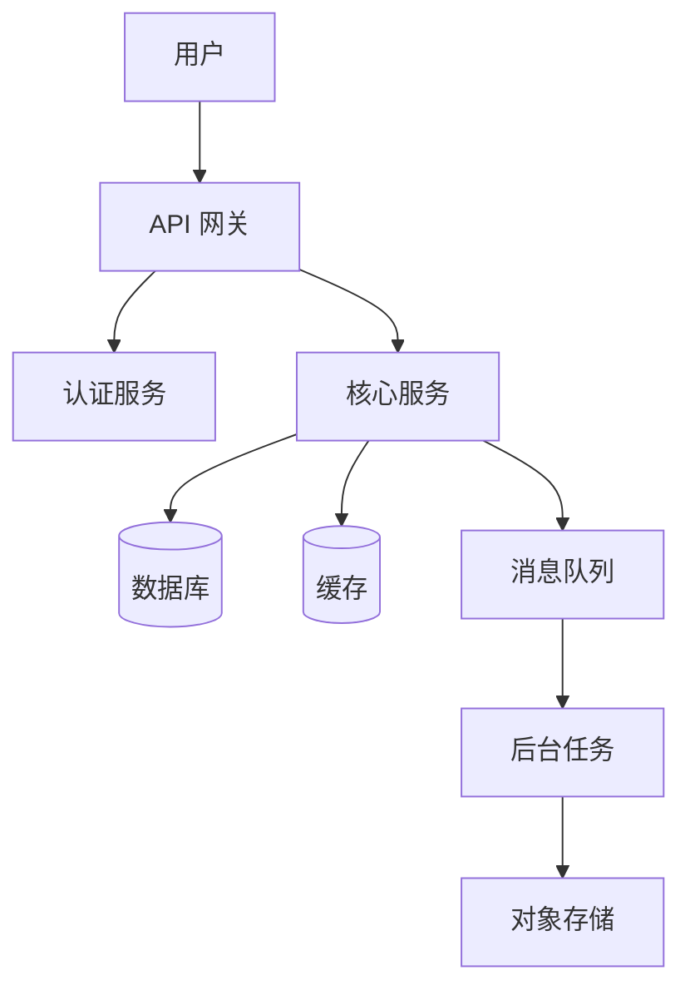
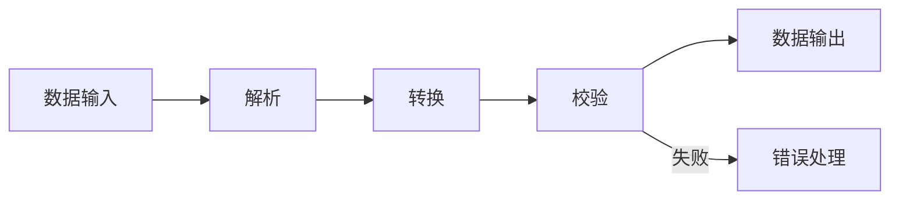
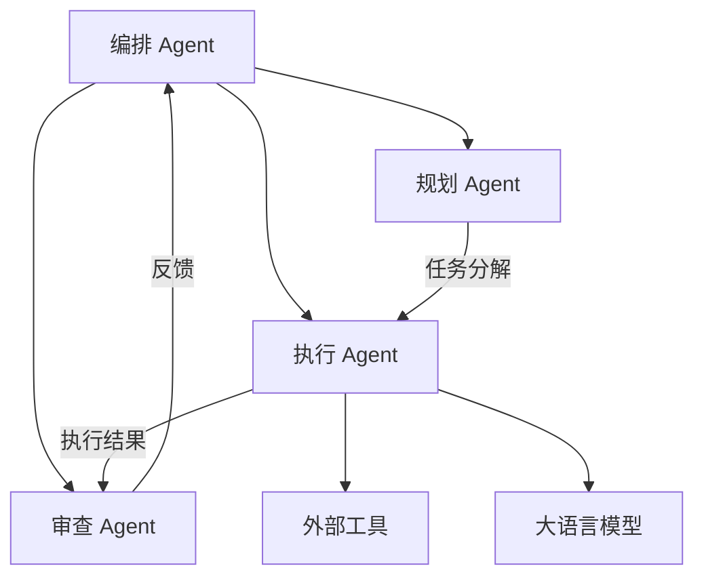
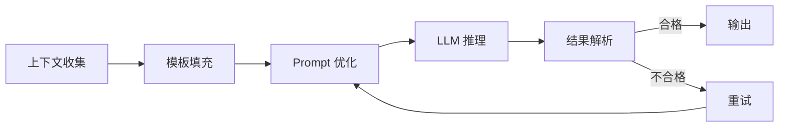
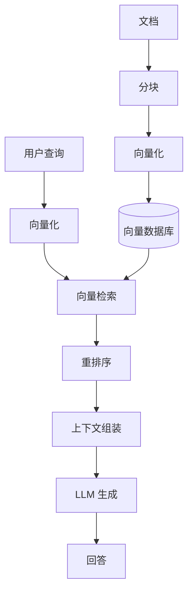
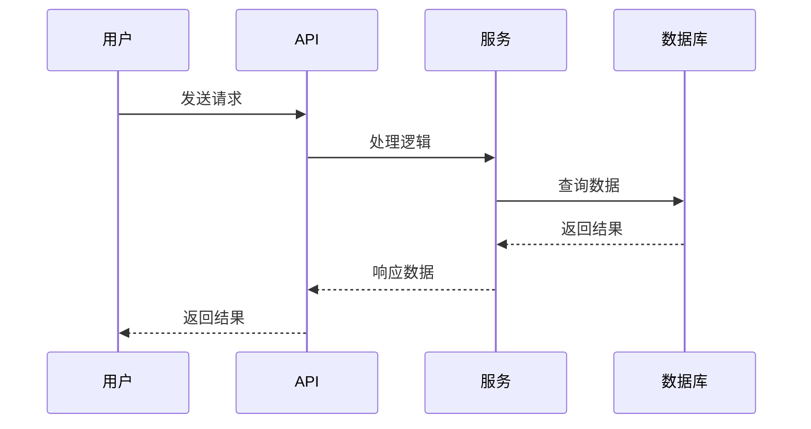
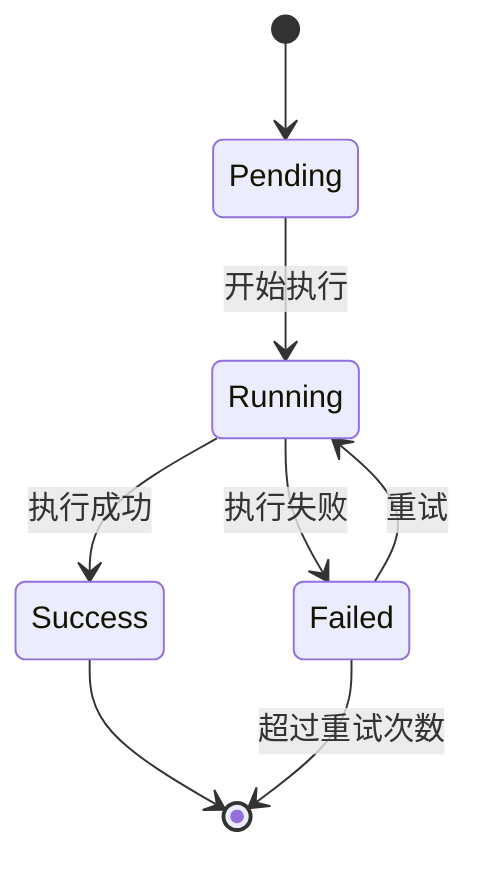
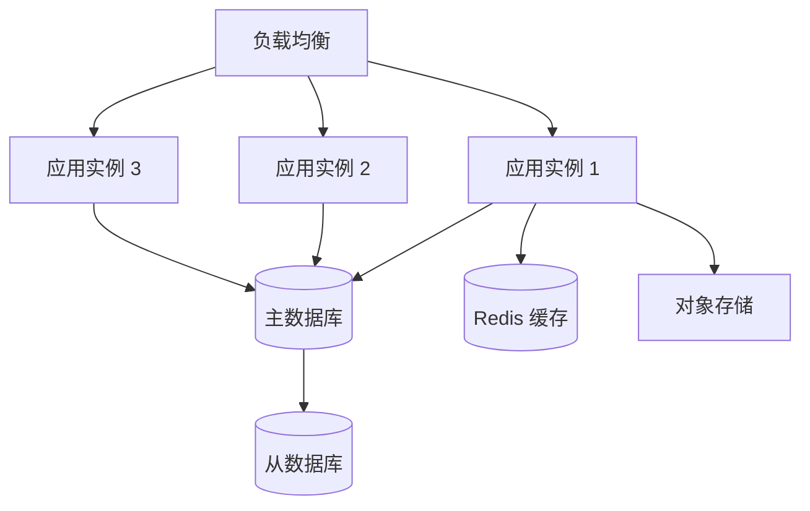
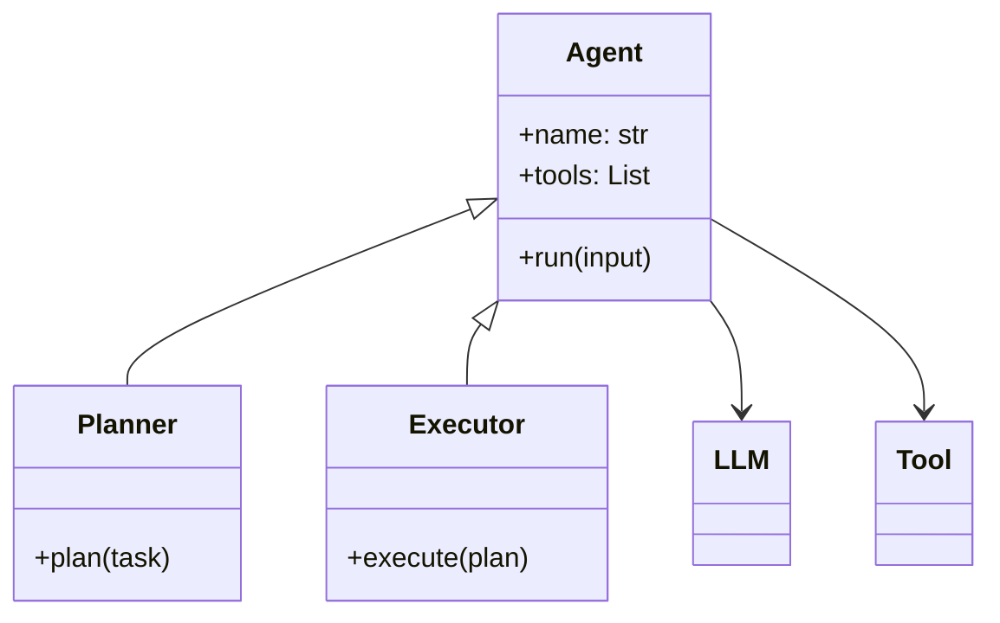

# Mermaid 图常用模式

## 1. 系统架构图

适用于展示整体系统模块和关系。

**使用场景**：全栈应用、微服务架构、平台型项目

---

## 2. 数据流图

适用于展示数据从输入到输出的流转过程。

**使用场景**：数据处理管道、ETL 流程、编译器

---

## 3. Agent 编排图

适用于展示 AI Agent 的协作关系。

**使用场景**：Multi-Agent 系统、AI 编排平台

---

## 4. Prompt Pipeline 图

适用于展示 Prompt 的流转和处理过程。

**使用场景**：Prompt 工程、AI 应用

---

## 5. RAG 流程图

适用于展示检索增强生成的完整流程。

**使用场景**：RAG 系统、知识库问答

---

## 6. 时序图

适用于展示组件间的时序交互。

**使用场景**：API 调用流程、认证流程、支付流程

---

## 7. 状态图

适用于展示系统或对象的状态转换。

**使用场景**：任务状态机、订单流程、部署流程

---

## 8. 部署架构图

适用于展示部署拓扑和基础设施。

**使用场景**：云原生应用、微服务部署

---

## 9. 类/模块关系图

适用于展示代码层面的抽象关系。

**使用场景**：库/SDK 设计、框架架构

---

## 使用原则

1. **选择合适的图表类型** — 不要为了用 Mermaid 而用 Mermaid
2. **保持简洁** — 节点不超过 15 个，层级不超过 4 层
3. **标注关键信息** — 数据流向、协议、关键决策点
4. **与文字配合** — 图后必须有文字说明各模块职责
5. **中文标签** — 所有节点标签使用中文
